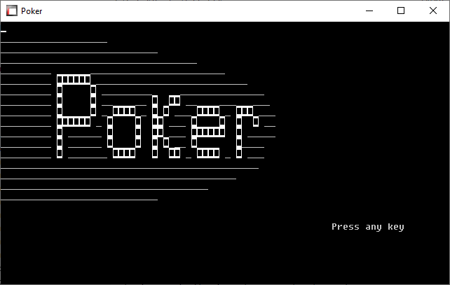
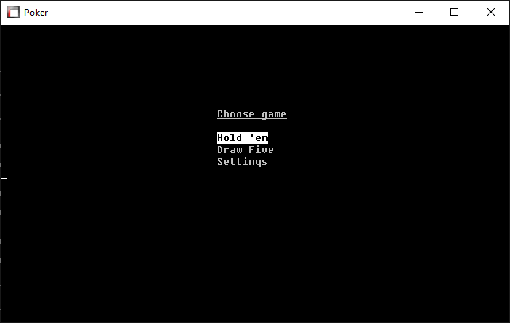
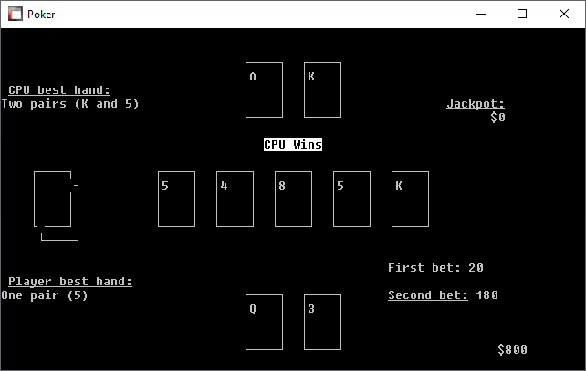

# COBOL Poker Game

This is a simple implementation of a Poker game written in COBOL. I developed this project during my time as a student to practice my COBOL programming skills.

## Features

- **User Interface:** Simple text-based interface for user interaction.
- **Single Player:** Designed for single-player gameplay against computer opponents.
- **Poker Rules:** Follows standard Poker rules for Hold 'em and Draw Five
- **Randomization:** Uses custom randomization method to shuffle the deck and deal cards to players.

## Requirements

- COBOL compiler (e.g., AcuCOBOL or GnuCOBOL)
- Terminal or command line interface to run the compiled program

## How to Run
You can either:
1. Run the Poker.acu file with the bin/wrun32.exe
2. Compile the Poker.CBL source code yourself and execute it

## Project Structure

- **Poker.CBL:** Main COBOL source code file containing the game logic.
- **Poker.acu:** Ready-to-play file, to be executed with wrun32.exe
- **wrun32.exe** ACUCOBOL-GT 32-bit Runtime to execute the game
- **CODD.BAT** Batch to compile the script
- **RUN.BAT** Batch to run the game
- **README.md:** This file providing information about the project.
